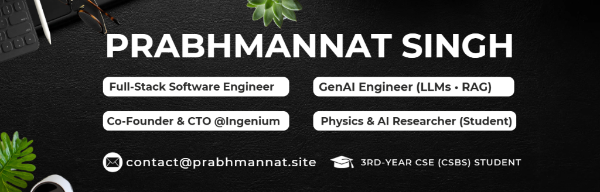

<!-- =======================
   PROFILE README — Prabhmannat Singh
   ✅ Repo must be named exactly your GitHub username
   ✅ Place header image in repo root as: Prabh-linkedin-header.png
   ======================= -->

<!-- ===== TOP HEADER IMAGE (YOUR PROVIDED BANNER) ===== -->

  

<!-- ===== TYPING ANIMATION ===== -->

<!-- ===== CTA LINKS ===== -->

 
  
  
  

---

## About Me

I'm a **3rd-year Computer Science and Business Systems (CSBS)** student at **Chandigarh University** and a **startup founder**. I co-founded **Ingenium**, a **University of Sydney–incubated EdTech startup**, and I'm a researcher with a proven record of securing multiple grants and funding. 

I build **production-grade full-stack web and mobile products** using **React/Next.js, Node.js, REST APIs, databases, and AWS**, with a strong **GenAI focus** on shipping **RAG and agentic workflows** into scalable, real-world products.

**Core Focus Areas**

---

### 🏆 Achievements & Awards

- 💰 **₹60,000 Research/Innovation Grant** — Awarded by Corporate Advisory Board (University Innovation Cell)
- 📘 **Book Authorship** — Assistant Author for research book on Black Holes with Monash University faculty
- 🥈 **2nd Place, Monash Hackathon** — Ranked 2nd out of 800+ teams in Monash University's global event
- 🦈 **Shark Tank India Pitch** — Presented startup to judges Aman Gupta & Anupam Mittal at CU Ignite
- 🏅 **Google Startup Award** — Won "People's Choice Award" at Google Sydney HQ for Ingenium's innovation
- 💵 **University of Sydney Funding** — Secured $1,000 USD INCUBATE grant for product development
- 🥇 **Winner, Smart Tech Ideathon 2.0** — Education Domain winner for revolutionizing learning outcomes
- 🥇 **Winner, ThinkLab Ideathon** — 1st place with Ingenium (AI-driven learning platform)
- 🤝 **Thapar Ventures MoU** — Signed MoU at E-Summit 25 to support regional startup ecosystem
- 🎓 **IIT Mandi Alliance** — Collaborated with IIT Mandi Catalyst ventures during FrostHack 2025

---

## 🔭 What I'm Up To (right now)

| **Focus Area** | **Current Work** |
|:---:|:---|
| 🚧 **Building** | Text-to-Simulation pipelines • Virtual Simulation Labs • EdTech products |
| 🤖 **Engineering** | RAG + Agentic Systems (LangGraph/LangChain) • Production AI workflows • Evaluation loops |
| 🌌 **Research** | Astronomy simulations • Black hole dynamics • Physics modeling experiments |
| 🤝 **Open to Collaborate** | Commissioned projects • AI/NLP/DL research • Physics AI projects • Full-stack MVPs |

---

## 📚 Research Work

- **VLab Text-to-Simulation** — Natural language → interactive STEM simulation experiences  
- **Robust Semantic Watermarks for LLM Outputs** under retrieval & editing  
- **Detection of AI-Generated Art & Painting Plagiarism** using model optimization  
- **Swasth AI** — diagnostics & model fusion research  
- **Python-based Visual Chatbot** for research-grade HCI apps

  

---

## 🧰 Tech Stack

 
 

 
 

---

## 🔥 Featured Projects

| 💡 **Project** | ⚙️ **Description** | 🛠️ **Tech Stack** |
|:---|:---|:---:|
| **[Ingenium VLab](https://github.com/PRABHMANNAT/virtual-lab)**   *Virtual Simulation Lab* | Core platform for Ingenium's Virtual Lab experience with text-to-simulation workflows and interactive STEM simulations | `Next.js` `Node.js` `AI/ML` |
| **[Swasth-AI](https://github.com/PRABHMANNAT/Swasth-AI-Medical-llm-fusion-model-AI-diagnosis)**   *Medical LLM Fusion* | Medical LLM fusion pipeline for structured AI diagnosis outputs and research iteration | `Python` `LLMs` `ML` |
| **[Finance Tracker](https://github.com/PRABHMANNAT/Real-Time-Personal-Finance-Tracker)**   *Real-Time Dashboard* | Track income/expenses with real-time insights, category analysis, and clean dashboard UX | `React` `Node.js` `Database` |
| **HiggsWardrobe AR**   *AI Fashion Try-On* | AR clothing try-on with AI-powered editing (Higgsfield + Nanobana integration) | `React Native` `GenAI` |
| **Agentic RAG Knowledge OS**   *Multi-Agent System* | Advanced RAG workspace: document ingestion → retrieval → citations → reports with evaluation | `LangGraph` `RAG` `Python` |
| **AI-Art Plagiarism Detector**   *Computer Vision Research* | Detection system for AI-generated art and plagiarism using advanced feature learning | `CV` `ML` `Python` |

---

## What I Love Building

<table>
<tr>
<td align="center" width="33%">

### AI-Driven Systems

**Intelligent Agents** • **NPC Behaviors** • **Procedural Generation** • **Autonomous Decision Making**

Crafting intelligent systems where AI entities make autonomous decisions, learn from patterns, adapt to environments, and create emergent, dynamic gameplay experiences that feel truly alive.

</td>
<td align="center" width="33%">

### Simulation Engines

**Physics Modeling** • **Astronomy Visualization** • **Real-time Rendering** • **Interactive Experiences**

Developing realistic physics-based simulations and astronomical visualizations that bring complex scientific concepts to life through interactive, educational, and visually stunning experiences.

</td>
<td align="center" width="33%">

### Automation Tools

**Smart Dashboards** • **Data Pipelines** • **AI Assistants** • **Workflow Automation**

Engineering powerful automation solutions that eliminate repetitive tasks, streamline complex workflows, and empower teams to focus on creative problem-solving rather than manual processes.

</td>
</tr>
</table>

---

##  Let's Connect & Collaborate

 **Open to discussing AI products, research collaborations, or building something innovative together!** 

 

 
 

