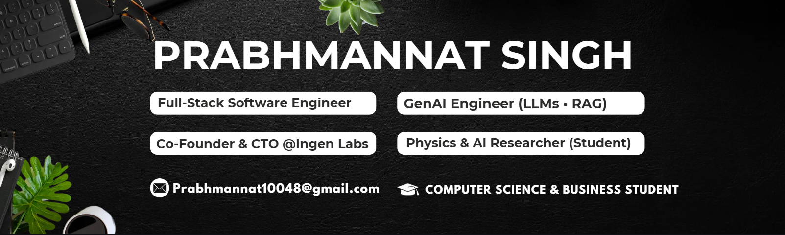
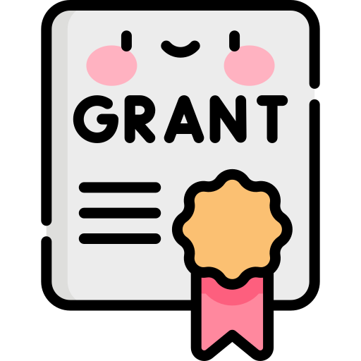
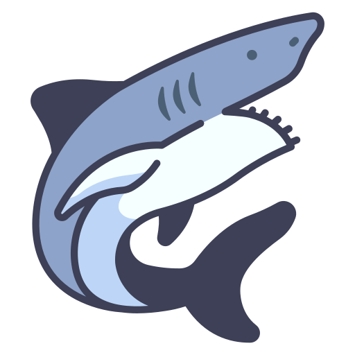
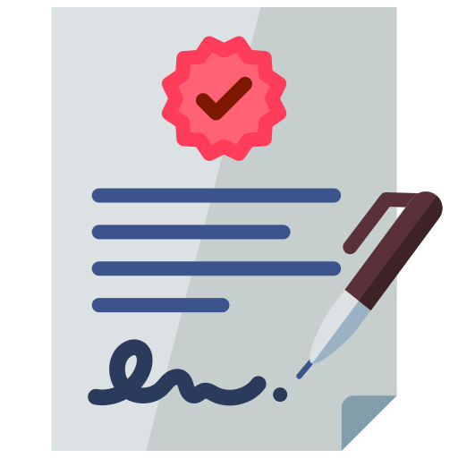
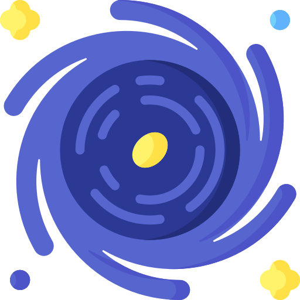
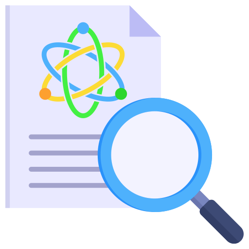

<!-- =======================
   PROFILE README — Prabhmannat Singh
   ✅ Repo must be named exactly your GitHub username
   ✅ Place header image in repo root as: Prabh-linkedin-header.png
   ======================= -->

<!-- ===== TOP HEADER IMAGE (YOUR PROVIDED BANNER) ===== -->

  

<!-- ===== TYPING ANIMATION ===== -->

<!-- ===== CTA LINKS ===== -->

 
  
  
  

---

## About Me

I'm a **3rd-year Computer Science and Business Systems (CSBS)** student at **Chandigarh University** and a **startup founder**. I co-founded **Ingenium**, a **University of Sydney–incubated EdTech startup**, and I'm a researcher with a proven record of securing multiple grants and funding. 

I build **production-grade full-stack web and mobile products** using **React/Next.js, Node.js, REST APIs, databases, and AWS**, with a strong **GenAI focus** on shipping **RAG and agentic workflows** into scalable, real-world products.

**Core Focus Areas**

---

##  Notable Achievements

&nbsp;&nbsp;

 

###  International Recognition

<table>
<tr>
<td width="60" align="center"></td>
<td><b>Top Selected Presenter — London Tech Week 2026</b> 
Presented research at <b>London Tech Week 2026</b> as one of the top selected presenters — gaining international exposure at a leading global technology and innovation platform.</td>
</tr>
<tr>
<td align="center"></td>
<td><b>2nd Place — Monash University Global Hackathon</b> 
Ranked <b>2nd out of 800+ teams</b> in a global hackathon organized by <b>Monash University</b>.</td>
</tr>
<tr>
<td align="center"></td>
<td><b>Google Startup People's Choice Award — Sydney</b> 
Won the <b>People's Choice Award</b> at <b>Google Sydney HQ</b> for Ingenium's innovation and impact in education technology.</td>
</tr>
</table>

---

###  Grants & Funding

<table>
<tr>
<td width="60" align="center"></td>
<td><b>₹1,00,000 Research Grant — Medical AI System</b> 
Received a <b>₹1 lakh research grant</b> for developing a <b>Multimodal Medical Fusion Diagnosis System</b> focused on advanced healthcare diagnostics.</td>
</tr>
<tr>
<td align="center"></td>
<td><b>₹60,000 Research / Innovation Grant</b> 
Awarded by the <b>Corporate Advisory Board, University Innovation Cell</b> for innovation-driven research and development.</td>
</tr>
<tr>
<td align="center"></td>
<td><b>USD $1,000 INCUBATE Funding — University of Sydney</b> 
Secured <b>$1,000 USD funding</b> from the <b>University of Sydney INCUBATE program</b> to support product development for Ingenium.</td>
</tr>
</table>

---

###  Hackathons & Competitions

<table>
<tr>
<td width="60" align="center"></td>
<td><b>Winner of 11+ Hackathons</b> 
Won <b>11+ hackathons</b> — including <b>4 national-level</b> and <b>2 international</b> — demonstrating strong innovation, product-building, and problem-solving skills.</td>
</tr>
<tr>
<td align="center"></td>
<td><b>Winner — Project Expo 2026, Chandigarh University</b> 
Won <b>1st place at the university level</b> as an <b>all-category winner</b> for outstanding project innovation.</td>
</tr>
<tr>
<td align="center"></td>
<td><b>Winner — Hackshastra 2026</b> 
Secured <b>1st place</b> for innovation, technical execution, and real-world problem-solving.</td>
</tr>
<tr>
<td align="center"></td>
<td><b>Winner — Smart Tech Ideathon 2.0</b> 
Won the <b>Education Domain</b> category for building solutions focused on improving learning outcomes.</td>
</tr>
<tr>
<td align="center"></td>
<td><b>Winner — ThinkLab Ideathon</b> 
Secured <b>1st place</b> with <b>Ingenium</b>, an AI-driven learning platform designed to make education more interactive and accessible.</td>
</tr>
</table>

---

###  Honors & Awards

<table>
<tr>
<td width="60" align="center"></td>
<td><b>Shark Tank India Pitch — CU Ignite</b> 
Presented startup work to <b>Shark Tank India judges Aman Gupta and Anupam Mittal</b> at CU Ignite.</td>
</tr>
<tr>
<td align="center"></td>
<td><b>Exemplary Achievement Award — Abhyuthanam 2026</b> 
Honoured by <b>Chandigarh University</b> for outstanding contributions in innovation, research, and entrepreneurship.</td>
</tr>
<tr>
<td align="center"></td>
<td><b>Thapar Ventures MoU — E-Summit 2025</b> 
Signed an <b>MoU with Thapar Ventures</b> to support and strengthen the regional startup ecosystem.</td>
</tr>
</table>

---

###  Research & Publications

<table>
<tr>
<td width="60" align="center"></td>
<td><b>Assistant Author — Black Holes Research Book</b> 
Served as an <b>Assistant Author</b> for a research book on <b>Black Holes</b> with Monash University faculty, contributing to research on <b>Sagittarius A*</b>.</td>
</tr>
<tr>
<td align="center"></td>
<td><b>Swasth AI — Medical Diagnostics & Model Fusion Research</b> 
Multimodal LLM fusion pipeline for structured AI diagnosis outputs, advanced healthcare diagnostics, and research iteration.</td>
</tr>
<tr>
<td align="center"></td>
<td><b>Python-based Visual Chatbot for Research-grade HCI Apps</b> 
Built a visual chatbot system designed for human-computer interaction research and applied NLP experimentation.</td>
</tr>
<tr>
<td align="center"></td>
<td><b>VLab Text-to-Simulation — Natural Language → Interactive STEM Experiences</b> 
Natural language driven pipeline that generates interactive STEM simulations for immersive educational experiences.</td>
</tr>
<tr>
<td align="center"></td>
<td><b>Robust Semantic Watermarks for LLM Outputs</b> 
Research on embedding and detecting semantic watermarks in LLM-generated text under retrieval and editing conditions.</td>
</tr>
</table>

---

## 🧰 Tech Stack

  

  

  

  

  

  

---

## 📊 GitHub Activity & Contribution Streak

<!-- 2026 Contributions + Current Streak + Longest Streak (all in one widget) -->

  

<!-- Contribution Activity Graph -->

---

## 🔥 Featured Projects

| 💡 **Project** | ⚙️ **Description** | 🛠️ **Tech Stack** |
|:---|:---|:---:|
| **[Ingenium VLab](https://github.com/PRABHMANNAT/virtual-lab)**   *Virtual Simulation Lab* | Core platform for Ingenium's Virtual Lab experience with text-to-simulation workflows and interactive STEM simulations | `Next.js` `Node.js` `AI/ML` |
| **[Swasth-AI](https://github.com/PRABHMANNAT/Swasth-AI-Medical-llm-fusion-model-AI-diagnosis)**   *Medical LLM Fusion* | Medical LLM fusion pipeline for structured AI diagnosis outputs and research iteration | `Python` `LLMs` `ML` |
| **[Finance Tracker](https://github.com/PRABHMANNAT/Real-Time-Personal-Finance-Tracker)**   *Real-Time Dashboard* | Track income/expenses with real-time insights, category analysis, and clean dashboard UX | `React` `Node.js` `Database` |
| **HiggsWardrobe AR**   *AI Fashion Try-On* | AR clothing try-on with AI-powered editing (Higgsfield + Nanobana integration) | `React Native` `GenAI` |
| **Agentic RAG Knowledge OS**   *Multi-Agent System* | Advanced RAG workspace: document ingestion → retrieval → citations → reports with evaluation | `LangGraph` `RAG` `Python` |
| **AI-Art Plagiarism Detector**   *Computer Vision Research* | Detection system for AI-generated art and plagiarism using advanced feature learning | `CV` `ML` `Python` |

---

## What I Love Building

<table>
<tr>
<td align="center" width="33%">

### AI-Driven Systems

**Intelligent Agents** • **NPC Behaviors** • **Procedural Generation** • **Autonomous Decision Making**

Crafting intelligent systems where AI entities make autonomous decisions, learn from patterns, adapt to environments, and create emergent, dynamic gameplay experiences that feel truly alive.

</td>
<td align="center" width="33%">

### Simulation Engines

**Physics Modeling** • **Astronomy Visualization** • **Real-time Rendering** • **Interactive Experiences**

Developing realistic physics-based simulations and astronomical visualizations that bring complex scientific concepts to life through interactive, educational, and visually stunning experiences.

</td>
<td align="center" width="33%">

### Automation Tools

**Smart Dashboards** • **Data Pipelines** • **AI Assistants** • **Workflow Automation**

Engineering powerful automation solutions that eliminate repetitive tasks, streamline complex workflows, and empower teams to focus on creative problem-solving rather than manual processes.

</td>
</tr>
</table>

---

##  Let's Connect & Collaborate

 **Open to discussing AI products, research collaborations, or building something innovative together!** 

 

 
 

